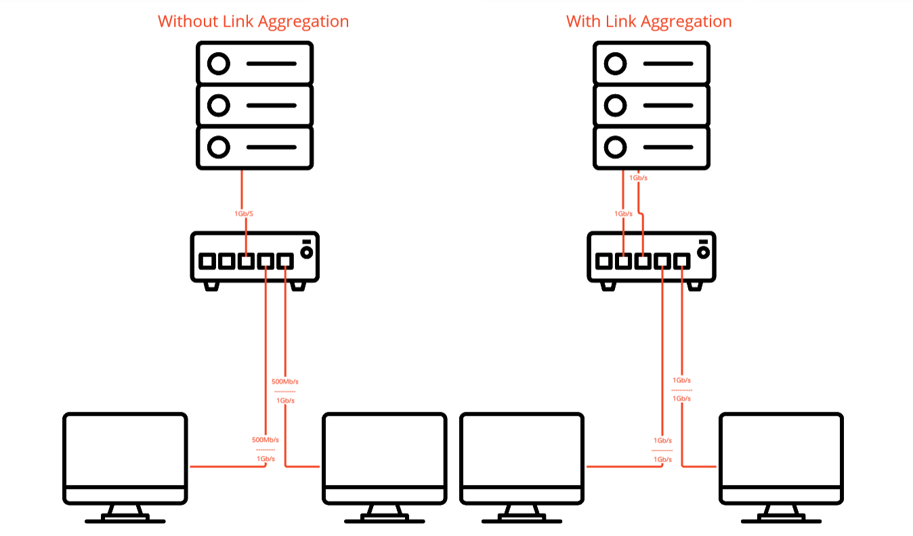

# **OpenClone**


## 1 - What's openClone

Welcome to the "OpenClone" project! This repository contains all the necessary scripts, configurations, and documentation to set up a network boot and cloning system. The primary goal of this project is to facilitate the deployment and maintenance of operating systems across multiple machines within a network, ensuring efficient and streamlined processes.
<br />
<br />
This project was developed as part of my Advanced Technician Certificate (Brevet de Technicien Supérieur, BTS) program. It has allowed me to apply and expand my knowledge in operating systems, networking, and scripting. By leveraging tools like PXE, TFTP, NFS, and various Linux utilities, this project demonstrates a comprehensive approach to network-based system deployment.
<br />
<br />
Feel free to modify it according to your specific needs!

<br />

## 2 - Installation

### 2.1 - Things to Know

The project has an option to deploy link aggregation for better efficiency or nftables (highly recommended for security purposes as it allows you to have a DHCP dedicated to this project).
<br />


<br />
What and Why Aggregation?
<br />
Link aggregation is a method used to combine multiple network connections into a single logical connection to increase throughput and provide redundancy. By deploying link aggregation, you can improve network performance
<br />
<br />


<br />

<br />
What and Why nftables?
<br />
nftables is a subsystem of the Linux kernel that provides filtering and classification of network packets/datagrams/frames. It is a replacement for the legacy iptables framework and offers several advantages, including better performance, ease of use, and more advanced features. Using nftables can enhance the security of your network by providing more efficient and flexible packet filtering rules.
<br />
<br />


<br />

<br />

### 2.2 - Requirements

You'll need at least 500MB for all the services and some disk storage for the ISOs you want to add.

Debian 12 is the only distribution tested for now (but it should be compatible with all Debian-based distributions).

   - CPU: Still to determine
   - RAM: Still to determine (probably heavy if you have multiple machines)

I will test soon on some ranges between:

   - 1-5 machines
   - 5-10 machines
   - 10-30 machines
<br />

### 2.3 - How to install

First, ensure that your machine is up to date:

```
# apt update
# apt upgrade
```

<br />

cgvhbjnkfcgvhbjkl

<br />

```
$ git clone https://github.com/Matheo2604/openClone
$ cd openClone/
# bash install.sh 
```

## 3 - Usage

### 3.1 - How to Boot in PXE Mode

### 3.2 - How to Use Our Maintenance Linux

### 3.3 - How to Add an OS

## 4 - Troubleshooting